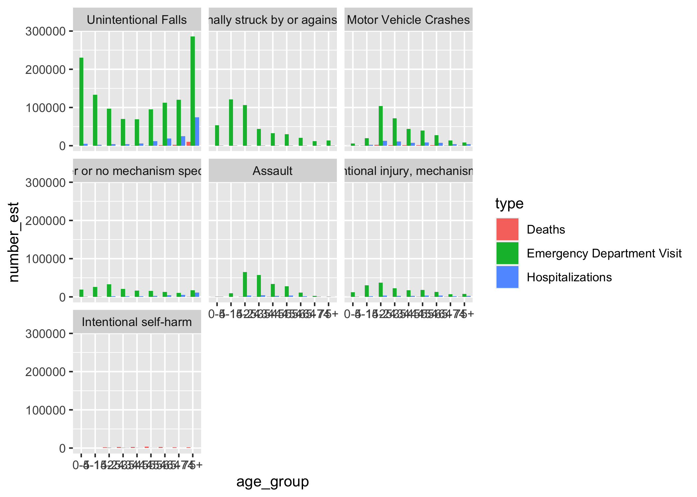
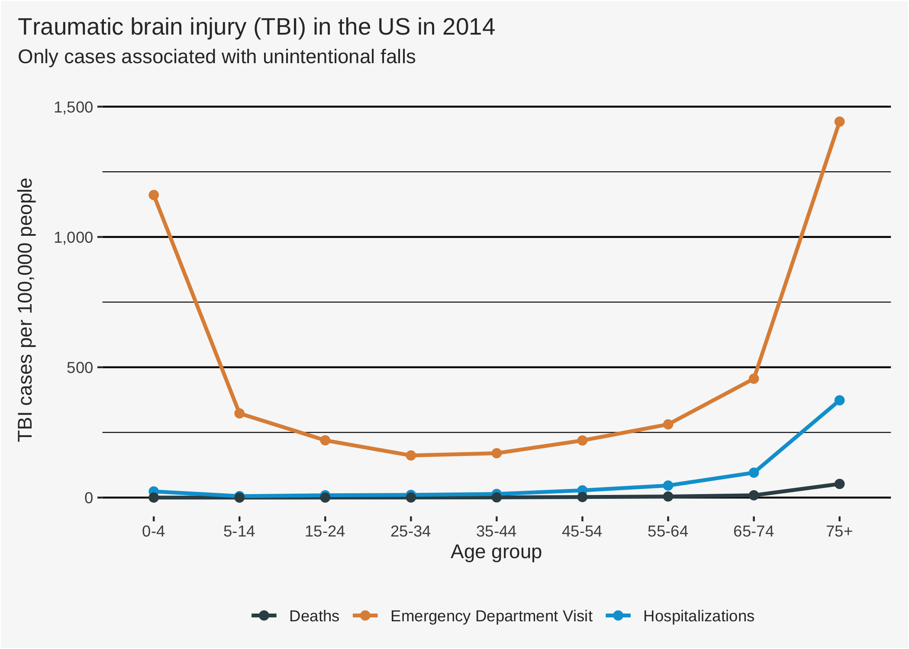

tidytuesday: Traumatic Brain Injury
================
Joshua Nowak
2020-04-11

This data is part of the tidytuesday challenge from 2020-03-24. Further
information about the datasets can be found at the [tidytuesday github
repo](https://github.com/rfordatascience/tidytuesday/tree/master/data/2020/2020-03-24).

``` r
library(tidyverse)
library(knitr)
library(ggsci)
options(scipen = 999)

tbi_all <- map(list(tbi_age = 'https://raw.githubusercontent.com/rfordatascience/tidytuesday/master/data/2020/2020-03-24/tbi_age.csv',
                    tbi_year = 'https://raw.githubusercontent.com/rfordatascience/tidytuesday/master/data/2020/2020-03-24/tbi_year.csv',
                    tbi_military = 'https://raw.githubusercontent.com/rfordatascience/tidytuesday/master/data/2020/2020-03-24/tbi_military.csv'), read_csv)

# Correcting the variables classes: the character columns should be factors.
tbi_all <- map(tbi_all, function(x) mutate_if(x, is.character, as.factor))
tbi_age <- tbi_all[[1]]
tbi_year <- tbi_all[[2]]
tbi_military <- tbi_all[[3]]
rm(tbi_all)
```

## `tbi_age`: Traumatic brain injury by age

### Data preparation

The age groups are messy, they overlap for ages \< 25. In particular,
“0-17” stands
    out.

``` r
levels(tbi_age$age_group)
```

    ##  [1] "0-17"  "0-4"   "15-24" "25-34" "35-44" "45-54" "5-14"  "55-64" "65-74"
    ## [10] "75+"   "Total"

A possible reason could be that different age groups were defined at
different places of data collection. However, all factor combinations of
`age_group`, `type`, and `injury_mechanism` occur exactly once in the
data.

``` r
all(with(tbi_age, table(age_group, type, injury_mechanism)) == 1)
```

    ## [1] TRUE

In my view, there are two options: 1. The age group “0-17” contains
redundant information (i.e., cases that are also counted within the age
groups “0-4”, “5-14” and “15-24”) and is just another aggregation of the
same underlying data. 2. The age group “0-17” contains additional
information (i.e., cases that are not counted in the other overlapping
age groups). This might be the case if data was collected in a different
fashion at different institutions.

I think that option 1 is more plausible. Tidytuesday does not provide
information on this. The original source ([CDC
report](https://www.cdc.gov/traumaticbraininjury/pdf/reportstocongress/managementoftbiinchildren/TBI-ReporttoCongress-508.pdf))
always mentions the age groups “0-4”, “5-14” and “15-24”.

We can try to falsify option 1 by comparing the TBI cases between the
age groups. The sum of cases in age groups “0-4” and “5-14” should
always be smaller than the number of cases in age group “0-17”.

``` r
tmp <- tbi_age %>% 
    filter(age_group %in% c("0-4", "5-14", "0-17")) %>% 
    pivot_wider(names_from = age_group,
                values_from = number_est,
                names_prefix = "age_") %>% 
    mutate(`age_0-14` = `age_0-4` + `age_5-14`) %>% 
    select(-`age_0-4`, -`age_5-14`) %>% 
    mutate(age_test = `age_0-17` - `age_0-14`) # this should return only positive values

all(tmp$age_test > 0, na.rm = TRUE)
```

    ## [1] TRUE

This plausibility check shows: There are always less cases in age group
“0-14” than in age group “0-17”. That does not prove our assumption
(option 1 mentioned above) but makes it much more likely.

We will just abandon that factor level for now and make some other final
adjustments.

``` r
tbi_age <- tbi_age %>% 
    filter(age_group != "0-17" & age_group != "Total") %>%
    mutate_at(vars(age_group), function(x) fct_relevel(x, "0-4", "5-14")) %>% 
    mutate_at(vars(age_group), droplevels)
```

### Visualizations

What are the most common injury mechanisms for TBI and how do they
spread across the age groups?

``` r
tbi_age %>% 
    ggplot(aes(age_group, number_est, fill = type)) +
    geom_bar(stat = "identity", position = "dodge") +
    facet_wrap(vars(fct_reorder(injury_mechanism, rate_est, sum, .desc = TRUE)))
```

<!-- -->

Let’s focus on unintentional falls, since there seem to be some
interesting patterns.

``` r
plot <- tbi_age %>% 
    filter(injury_mechanism == "Unintentional Falls") %>%
    ggplot(aes(age_group, rate_est, col = type, group = type)) +
    geom_line(size = 1) +
    geom_point(size = 2) +
    scale_y_continuous(labels = function(x) format(x, big.mark = ",")) +
    scale_color_jama() +
    labs(title = "Traumatic brain injury (TBI) in the US in 2014",
         subtitle = "Only cases associated with unintentional falls",
         x = "Age group",
         y = "TBI cases per 100,000 people") +
    theme(text = element_text(family = "Arimo for Powerline", 
                              color = "#333333"),
          panel.background = element_blank(),
          plot.background = element_rect(fill = "#F8F8F8"),
          plot.title.position = "plot",
          plot.subtitle = element_text(margin = margin(0, 0, 20, 0)), 
          axis.title.y = element_text(margin = margin(0, 10, 0, 0)),
          legend.title = element_blank(), 
          legend.key = element_blank(),
          legend.background = element_blank(),
          legend.position = "bottom",
          legend.margin = margin(c(10, 0, 0, 0)),
          panel.grid.major.x = element_blank(),
          panel.grid.major.y = element_line(color = "#000000"),
          panel.grid.minor.y = element_line(color = "#000000"), 
          plot.margin = margin(c(10, 10, 10, 10)))

plot
```

<!-- -->
